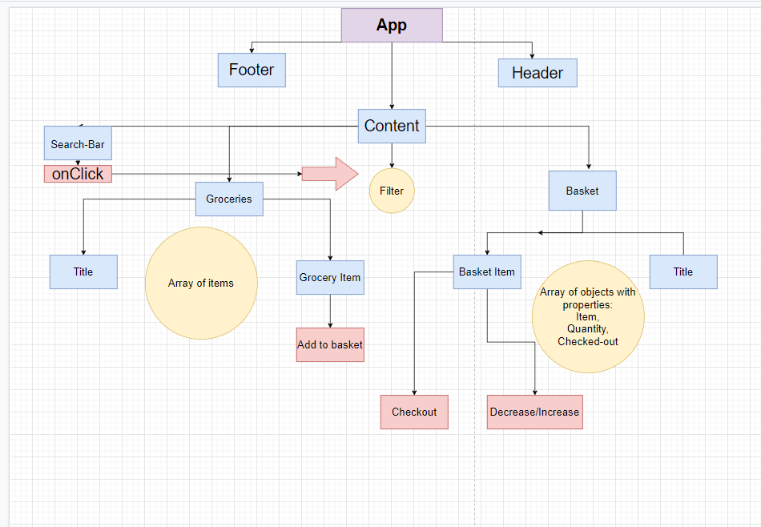

# Shopping Cart

[This](https://gabbymill.github.io/deploy-shop/) app built with react lets you handle a basic shopping list.
Add and remove items, change their quantity, cross them out when finished...

###### Have fun!

An image describing the flow of the application:

###### Blue rectangles represent _Components_

###### Orange circles represent _state_

###### Pink rectangles represent event handlers

##### [React](https://reactjs.org/)
